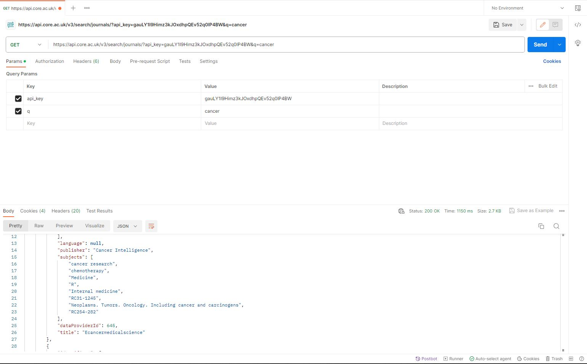
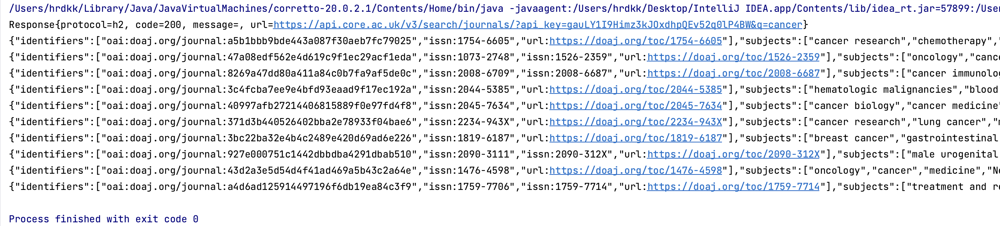

# Academic Chat System Project

## Project Overview
Our team is working on creating a basic academic chat system that allows multiple users to engage in real-time
conversations and query academic materials. In this project, we will use the CORE as the API that forms the basis of our
academic chat system.

## Focus Areas
Our team's primary focus for this project includes:

1. Real-time Communication: Implementing a real-time chat system where users can send and receive messages instantly.

2. Academic Content Query: Providing users with the ability to search for and access academic papers, articles, and research materials.

3. User Account Construction: Users can create their own accounts and secure user accounts, in order to protect user data and conversations.

4. Message Persistence: Storing chat messages securely and providing the ability to retrieve chat history.

5. User Experience: Creating an intuitive and user-friendly interface for seamless communication.

## Application Description
We are developing a web-based chat application that will allow users to create accounts, log in, and join academic
discussion rooms, and query academic materials from various sources. Users can send text messages to others in the same
chat room. Users can participate in real-time discussions, share academic resources, and collaborate with peers. The
application aims to provide a platform for academic exchange while ensuring the privacy and security of user data.

## Relevant API Documentation
To achieve the functionalities mentioned above, we plan to utilize the Resource API from CORE.

Resource API: https://api.core.ac.uk/docs/v3

## API Tool Screenshots

## JAVA example output

## Technical Challenges
We have encountered the following technical challenges that are currently hindering our progress:

1. Finding suitable APIs: We found that some good APIs are not available in IntelliJ.

2. Use of APIs: Unskilled use of APIs leads to difficulties in selecting and applying APIs.

